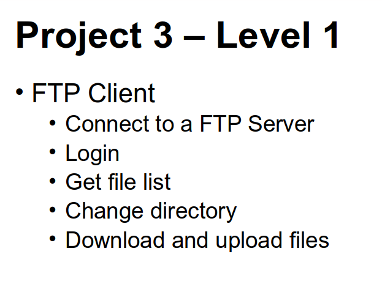

# FILEBOX
An app to connect you to a file server.



# Building project

If you have "make", simply type:

```
make
```

And everything will be done for you.

In case you don't, open Makefile and copy paste the compilation lines. 
Do whatever you want. I don't care.
